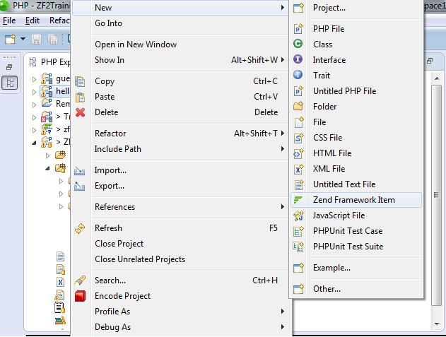
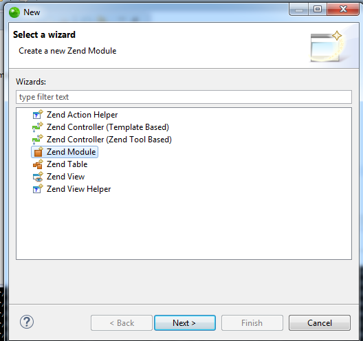
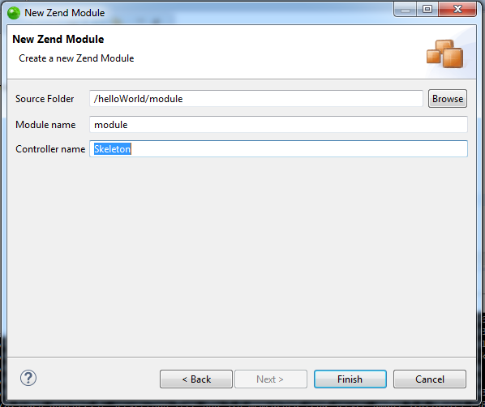

# Guest book

---

#Add new module guestbook

## Use Zend Studio

---

#Add new module guestbook

## Use Zend Studio

---

#Add new module guestbook

## Use Zend Studio

---

#Create new controller

	!php
	namespace Guestbook\Controller;
	use Zend\Mvc\Controller\AbstractActionController;
	class IndexController extends AbstractActionController
	{
	 public function indexAction()
	 {
	}

---

#Configure Route

	!php
	return array(
	'router' => array(
		'routes' => array(
		'guestbook' => array(
			'type' => 'literal',
				'options' => array(
						'route' => '/guestbook',
						'defaults' => array(
						'controller' => 'guestbook-index',
						'action' => 'index',
					),
				),
			),
		),
	),
	'controllers' => array(
		'invokables' => array(
			'guestbook-index' => 'Guestbook\Controller\IndexController'
			),
		),
	);

---

#Active View

## View Manager

In module/Guestbook/config/module.config.php file :

	!php
	'view_manager' => array(
			 'template_path_stack' => array(
			 'guestbook' => __DIR__ . '/../view',
		 ),
	 ),

---

#Active View

## Use View Model

In module/Guestbook/src/Guestbook/Controller/IndexController.php file :

	!php
	use Zend\View\Model\ViewModel;

And In IndexAction function we need to add :

	!php
	return new ViewModel();

Finaly add new file module/Guestbook/view/guestbook/index/index.phtml

	!html 
	<section>	
		<h1>Guestbook</h1>
		
New view for guestbook module

	</section>

---

#Use theme

Add css and js files in public/

Edit layout and include css and js file into project with $this->headLink() and $this->headScript()

Fixed the header and footer in Layout.phtml like this (example menu):

	!html
	<!-- header -->
	

		

		<ul>
			<li class="current_page_item"><a href="#">Homepage</a></li>
			<li><a href="#">Guest Book</a></li>
		</ul>
		

	

	<!-- content -->
	

		<?php echo $this->content; ?>
	

	<!-- footer -->
	

		
2012. Untitled. All rights reserved. Design by

	

---

#create a new action and new view book.phtml

---

#configure router and use link with zf
