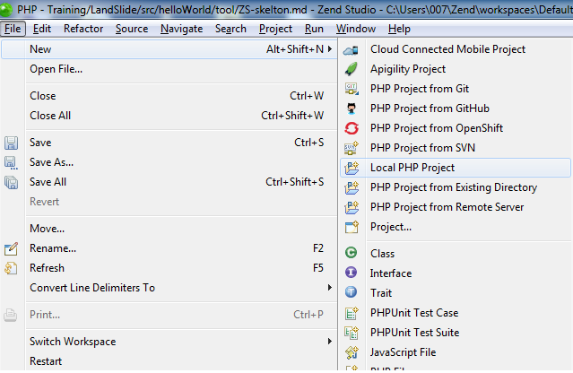
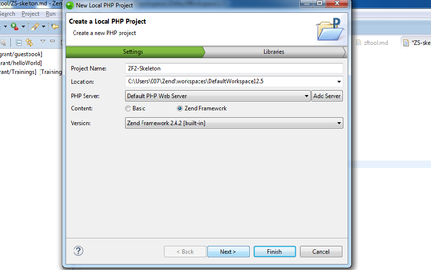
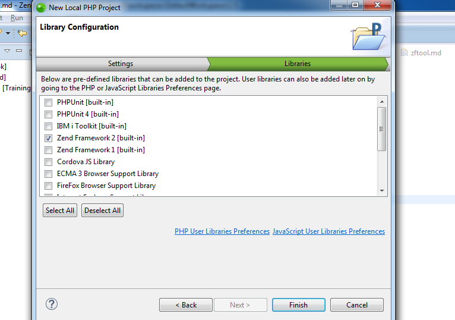

# INSTALL ZF2

---

# INSTALL ZF2

## Create Zend Skeleton Using zftool 

This command installs the ZendSkeletonApplication in the specified path.

	!sh
	$ zf.php create project project/zf2/path 

 <path> The path of the project to be created

---

# INSTALL ZF2

## Create Zend Skeleton Using Zend Studio (Step 1)

---

# INSTALL ZF2

## Create Zend Skeleton Using Zend Studio (Step 2)

---

# INSTALL ZF2

## Create Zend Skeleton Using Zend Studio (Step 3)

